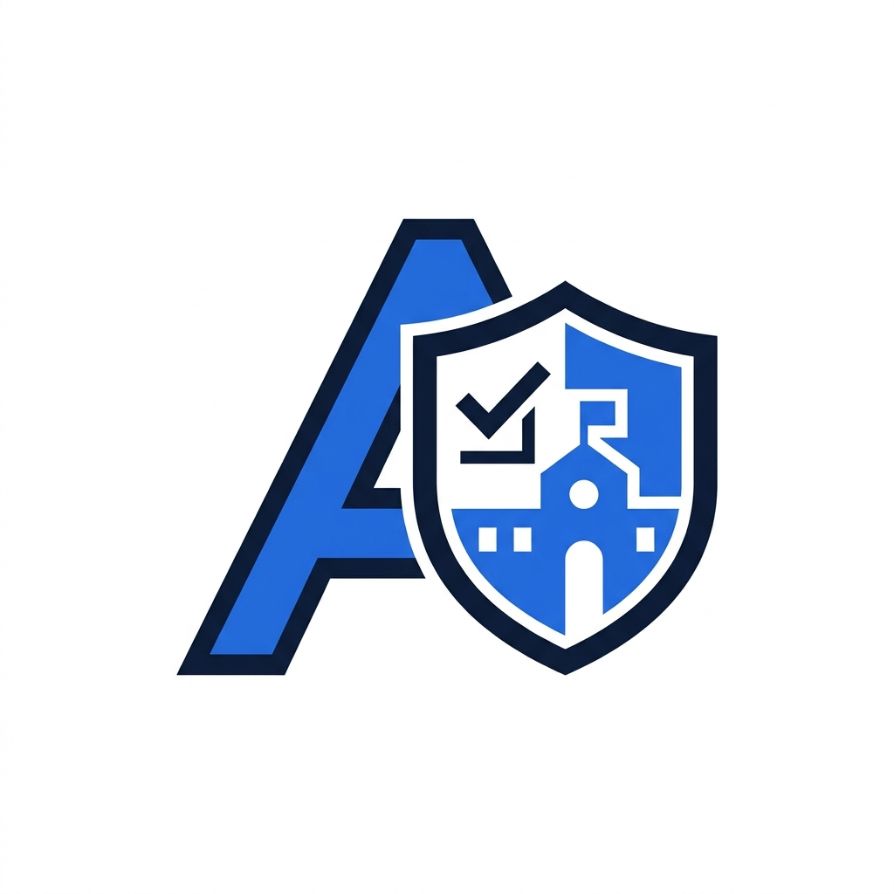

<div align="center">



# 🚀 Aplikasi Pengaduan Sarana Sekolah (APSS)

### Sistem Pelaporan Sarana & Prasarana Sekolah Berbasis Web

<p>


</p>

**Project UKK SMK RPL Paket 3 Tahun 2026**

</div>

---

# 📸 Tampilan Website

> Ganti gambar di bawah dengan screenshot website kamu.

## 🏠 Landing Page

<p align="center">

</p>

---

## 👨‍💼 Dashboard Admin

<p align="center">

</p>

---

## 👨‍🏫 Dashboard Guru

<p align="center">

</p>

---

## 👨‍🎓 Dashboard User

<p align="center">

</p>

---

# 📖 Tentang Project

Aplikasi Pengaduan Sarana Sekolah (APSS) merupakan sistem informasi berbasis web yang dirancang untuk mempermudah proses pelaporan kerusakan sarana dan prasarana sekolah.

Melalui aplikasi ini, siswa dapat mengirim pengaduan secara online, sedangkan Admin dan Guru dapat memverifikasi, menindaklanjuti, serta memantau seluruh laporan secara realtime.

---

# ✨ Fitur Utama

## 🌐 Landing Page

- Hero Section Modern
- Statistik Pengaduan
- Demo Aplikasi
- Testimoni
- FAQ
- Contact Center
- Responsive
- Dark Mode

---

## 🔐 Authentication

- Login Multi Role
- Admin
- Guru
- User
- Remember Me
- Captcha
- Forgot Password
- Password Hash

---

## 👨‍💼 Dashboard Admin

- Dashboard Modern
- Grafik Pengaduan
- Chart.js
- Statistik Realtime
- CRUD Lengkap
- Template Export
- Landing Page Management
- Testimoni Management
- Contact Management
- Notification Center

---

## 👨‍🏫 Dashboard Guru

- Dashboard Guru
- Monitoring Pengaduan
- Verifikasi
- Testimoni Approval
- Contact Management
- Export Laporan

---

## 👨‍🎓 Dashboard User

- Dashboard Personal
- Kirim Pengaduan
- Upload Foto
- Riwayat Pengaduan
- Timeline Status
- Testimoni
- Reset Password

---

## 📊 Laporan

- Export PDF
- Export Excel
- Print
- Filter
- Search
- Pagination

---

## 🎨 UI / UX

- Glassmorphism
- New Brutalism
- Gradient
- Bootstrap 5
- SweetAlert2
- AOS Animation
- Loading Screen
- Animated Counter
- Ripple Effect
- Floating Animation
- Responsive

---

# 🛠 Teknologi

| Frontend | Backend | Database |
|----------|----------|----------|
| HTML5 | PHP Native | MySQL |
| CSS3 | PHP 8 | MariaDB |
| Bootstrap 5 | mysqli | phpMyAdmin |
| JavaScript | Session | XAMPP |
| SweetAlert2 | Prepared Statement | |

---

# 📂 Struktur Project

```text
PSK/
│
├── admin/
├── guru/
├── user/
├── assets/
├── config/
├── includes/
├── laporan/
├── auth/
├── ajax/
├── database/
├── index.php
├── login.php
├── logout.php
└── README.md
```

---

# ⚙️ Cara Install

### Clone Repository

```bash
git clone https://github.com/USERNAME/aplikasi-pengaduan-sarana-sekolah.git
```

Masuk ke folder

```bash
cd aplikasi-pengaduan-sarana-sekolah
```

---

### Import Database

Buka

```
phpMyAdmin
```

Buat database

```
spk
```

Import

```
database/database.sql
```

---

### Jalankan

Copy project ke

```
C:\xampp\htdocs\
```

Jalankan

```
Apache
```

dan

```
MySQL
```

Kemudian buka

```
http://localhost/PSK
```

---

# 👤 Akun Default

| Role | Username | Password |
|------|----------|----------|
| Admin | admin | admin123 |
| Guru | guru1 | guru123 |
| User | siswa1 | user123 |

---

# 🔒 Keamanan

- Password Hash
- Prepared Statement
- Session Validation
- Role Based Access Control
- Upload Validation
- XSS Protection
- SQL Injection Protection

---

# 📱 Responsive

✅ Desktop

✅ Laptop

✅ Tablet

✅ Mobile

---

# 📌 Roadmap

- [x] Landing Page
- [x] Multi Role Login
- [x] CRUD Pengaduan
- [x] Dashboard Admin
- [x] Dashboard Guru
- [x] Dashboard User
- [x] Export PDF
- [x] Export Excel
- [x] Print
- [x] Testimoni
- [x] Contact Center
- [x] Responsive
- [ ] Email Notification
- [ ] WhatsApp Notification

---

# 👨‍💻 Developer

**Muhamad Farhan Muizaddin**

Project UKK SMK RPL Paket 3 Tahun 2026

---

<div align="center">

⭐ Jangan lupa berikan Star jika project ini bermanfaat ⭐

</div>
