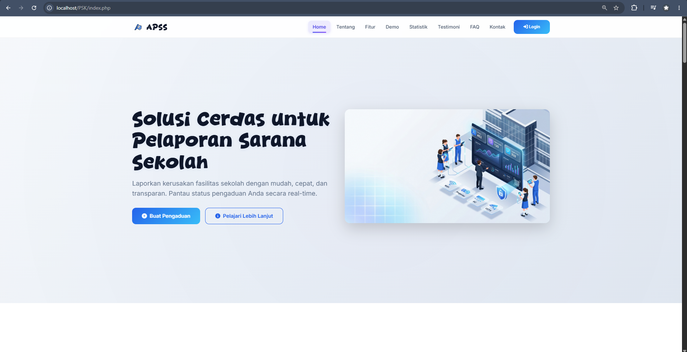
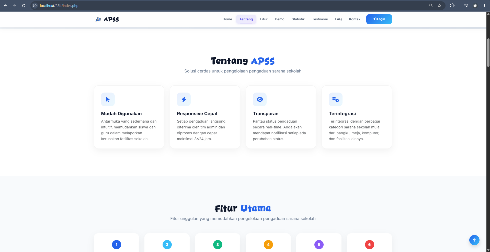
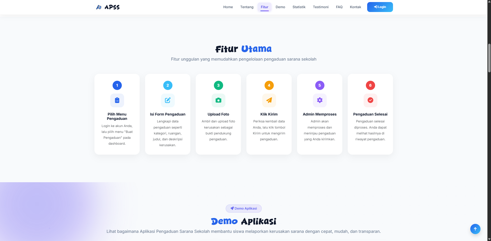
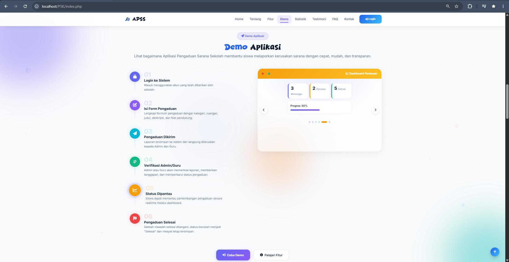
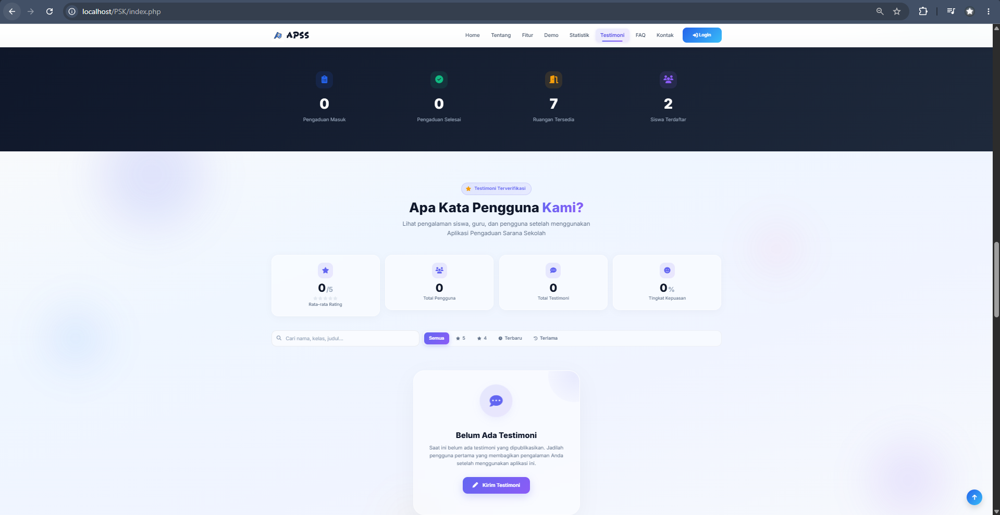
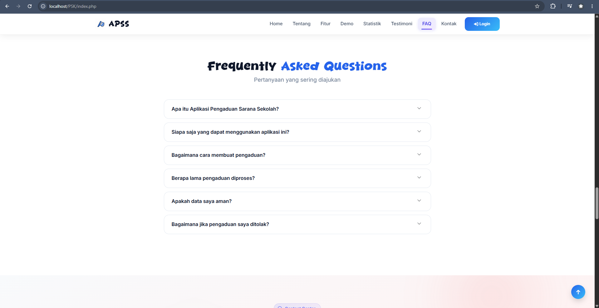
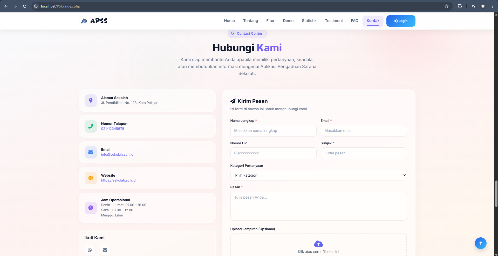
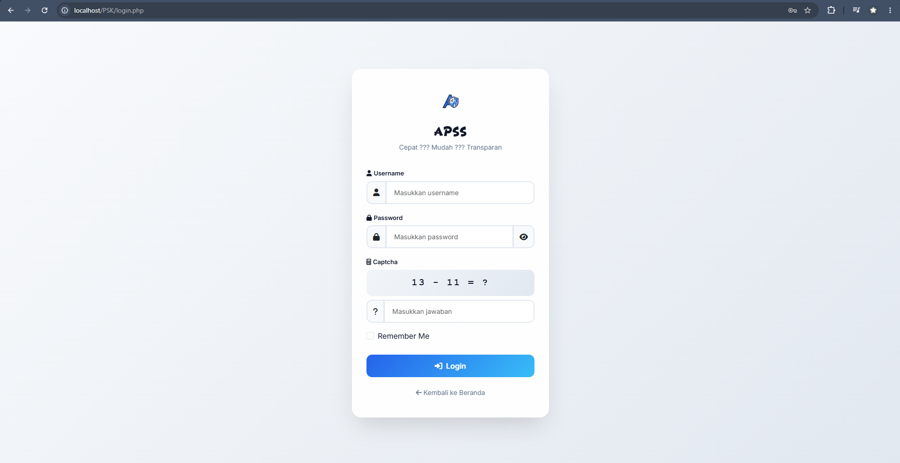

<div align="center">


# 🚀 Aplikasi Pengaduan Sarana Sekolah (APSS)

### Sistem Pelaporan Sarana & Prasarana Sekolah Berbasis Web

<p>


</p>

**Project UKK SMK RPL Paket 3 Tahun 2026**

</div>

---

# 📸 Tampilan Website

Berikut adalah beberapa tampilan utama dari **Aplikasi Pengaduan Sarana Sekolah (APSS)**.

---

## 🏠 Landing Page

<p align="center">

</p>

Halaman utama yang menampilkan seluruh informasi penting mengenai **Aplikasi Pengaduan Sarana Sekolah (APSS)** dengan desain modern, responsif, dan interaktif.

---

## 🚀 Hero Section

<p align="center">

</p>

**Fitur:**
- Banner utama dengan ilustrasi
- Call To Action (CTA)
- Tombol Login & Mulai Pengaduan
- Animasi modern
- Responsive

---

## ℹ️ Tentang Aplikasi

<p align="center">

</p>

**Berisi informasi mengenai:**
- Tujuan aplikasi
- Visi penggunaan
- Penjelasan sistem
- Keunggulan aplikasi

---

## ⭐ Fitur Unggulan

<p align="center">

</p>

**Fitur yang ditampilkan:**
- Multi Role Login
- Pengaduan Online
- Dashboard Interaktif
- Export PDF & Excel
- Notifikasi Realtime
- Testimoni
- Contact Center

---

## 🎥 Demo Aplikasi

<p align="center">

</p>

**Berisi:**
- Alur penggunaan aplikasi
- Penjelasan singkat setiap fitur
- Langkah penggunaan sistem

---

## 📊 Statistik & Testimoni

<p align="center">

</p>

**Informasi yang ditampilkan:**
- Total Pengaduan
- Pengaduan Selesai
- Pengguna Aktif
- Testimoni Pengguna
- Animated Counter

---

## ❓ Frequently Asked Questions (FAQ)

<p align="center">

</p>

**Berisi:**
- Cara membuat pengaduan
- Cara melihat status
- Cara menghubungi admin
- Pertanyaan umum lainnya

---

## 📞 Contact Center

<p align="center">

</p>

**Fitur:**
- Informasi kontak sekolah
- Google Maps
- Form Hubungi Kami
- Media Sosial
- Jam Operasional

---

## 📱 Responsive Design

Aplikasi telah dioptimalkan untuk berbagai perangkat:

- 💻 Desktop
- 💼 Laptop
- 📱 Smartphone
- 📟 Tablet

Menggunakan Bootstrap 5 sehingga seluruh tampilan tetap rapi dan nyaman digunakan pada berbagai ukuran layar.
---

## 🔐 Halaman Login

<p align="center">

</p>

Fitur:
- Login Multi Role
- Captcha
- Remember Me
- Show Password
- Forgot Password
- Validasi Login
- SweetAlert2

---

## 👨‍💼 Dashboard Admin

<p align="center">

</p>

Fitur:
- Statistik Pengaduan
- Grafik Chart.js
- Aktivitas Terbaru
- Realtime Clock
- Notification Center
- Quick Action

---

## 👨‍🏫 Dashboard Guru

<p align="center">

</p>

Fitur:
- Monitoring Pengaduan
- Approval Testimoni
- Kelola Pesan Kontak
- Export Laporan
- Dashboard Statistik

---

## 👨‍🎓 Dashboard User

<p align="center">

</p>

Fitur:
- Dashboard Personal
- Statistik Pengaduan
- Status Pengaduan
- Timeline Progress
- Quick Access

---

## 📝 Form Pengaduan

<p align="center">

</p>

Fitur:
- Upload Foto
- Pilih Kategori
- Pilih Ruangan
- Validasi Form
- SweetAlert2
- Preview Upload

---

## 📋 Riwayat Pengaduan

<p align="center">

</p>

Fitur:
- Timeline Status
- Detail Pengaduan
- Search
- Filter
- Pagination

---

## 📊 Kelola Data Pengaduan

<p align="center">

</p>

Fitur:
- CRUD Lengkap
- Search
- Filter
- Pagination
- Export
- Print

---

## 🏷️ Kelola Kategori

<p align="center">

</p>

CRUD Data Kategori Sarana.

---

## 🏫 Kelola Ruangan

<p align="center">

</p>

CRUD Data Ruangan Sekolah.

---

## 👥 Kelola Pengguna

<p align="center">

</p>

Fitur:
- Admin
- Guru
- User
- Reset Password
- Role Management

---

## ⭐ Kelola Testimoni

<p align="center">

</p>

Fitur:
- Approval Testimoni
- Publish Testimoni
- Moderasi
- CRUD

---

## 📞 Kelola Pesan Kontak

<p align="center">

</p>

Fitur:
- Inbox Pesan
- Detail Pesan
- Status Pesan
- CRUD

---

## 📄 Template Export

<p align="center">

</p>

Fitur:
- Template PDF
- Template Excel
- Print
- Header & Footer
- Logo Sekolah
- Watermark

---

## 📑 Export PDF

<p align="center">

</p>

Laporan PDF dengan desain profesional yang dapat disesuaikan.

---

## 📊 Export Excel

<p align="center">

</p>

Export data ke format Excel sesuai template.

---

## 🖨️ Print Laporan

<p align="center">

</p>

Cetak laporan langsung dari browser.

---

## ⚙️ Pengaturan Sistem

<p align="center">

</p>

Fitur:
- Pengaturan Website
- Landing Page
- Logo
- Template
- Informasi Sekolah

---

## 📱 Tampilan Mobile Responsive

<p align="center">


</p>

Seluruh halaman telah dioptimalkan agar responsif pada perangkat mobile dan tablet.

# 📖 Tentang Project

Aplikasi Pengaduan Sarana Sekolah (APSS) merupakan sistem informasi berbasis web yang dirancang untuk mempermudah proses pelaporan kerusakan sarana dan prasarana sekolah.

Melalui aplikasi ini, siswa dapat mengirim pengaduan secara online, sedangkan Admin dan Guru dapat memverifikasi, menindaklanjuti, serta memantau seluruh laporan secara realtime.

---

# ✨ Fitur Utama

## 🌐 Landing Page

- Hero Section Modern
- Statistik Pengaduan
- Demo Aplikasi
- Testimoni
- FAQ
- Contact Center
- Responsive
- Dark Mode

---

## 🔐 Authentication

- Login Multi Role
- Admin
- Guru
- User
- Remember Me
- Captcha
- Forgot Password
- Password Hash

---

## 👨‍💼 Dashboard Admin

- Dashboard Modern
- Grafik Pengaduan
- Chart.js
- Statistik Realtime
- CRUD Lengkap
- Template Export
- Landing Page Management
- Testimoni Management
- Contact Management
- Notification Center

---

## 👨‍🏫 Dashboard Guru

- Dashboard Guru
- Monitoring Pengaduan
- Verifikasi
- Testimoni Approval
- Contact Management
- Export Laporan

---

## 👨‍🎓 Dashboard User

- Dashboard Personal
- Kirim Pengaduan
- Upload Foto
- Riwayat Pengaduan
- Timeline Status
- Testimoni
- Reset Password

---

## 📊 Laporan

- Export PDF
- Export Excel
- Print
- Filter
- Search
- Pagination

---

## 🎨 UI / UX

- Glassmorphism
- New Brutalism
- Gradient
- Bootstrap 5
- SweetAlert2
- AOS Animation
- Loading Screen
- Animated Counter
- Ripple Effect
- Floating Animation
- Responsive

---

# 🛠 Teknologi

| Frontend | Backend | Database |
|----------|----------|----------|
| HTML5 | PHP Native | MySQL |
| CSS3 | PHP 8 | MariaDB |
| Bootstrap 5 | mysqli | phpMyAdmin |
| JavaScript | Session | XAMPP |
| SweetAlert2 | Prepared Statement | |

---

# 📂 Struktur Project

```text
PSK/
│
├── admin/
├── guru/
├── user/
├── assets/
├── config/
├── includes/
├── laporan/
├── auth/
├── ajax/
├── database/
├── index.php
├── login.php
├── logout.php
└── README.md
```

---

# ⚙️ Cara Install

### Clone Repository

```bash
git clone https://github.com/USERNAME/aplikasi-pengaduan-sarana-sekolah.git
```

Masuk ke folder

```bash
cd aplikasi-pengaduan-sarana-sekolah
```

---

### Import Database

Buka

```
phpMyAdmin
```

Buat database

```
spk
```

Import

```
database/database.sql
```

---

### Jalankan

Copy project ke

```
C:\xampp\htdocs\
```

Jalankan

```
Apache
```

dan

```
MySQL
```

Kemudian buka

```
http://localhost/PSK
```

---

# 👤 Akun Default

| Role | Username | Password |
|------|----------|----------|
| Admin | admin | admin123 |
| Guru | guru1 | guru123 |
| User | siswa1 | user123 |

---

# 🔒 Keamanan

- Password Hash
- Prepared Statement
- Session Validation
- Role Based Access Control
- Upload Validation
- XSS Protection
- SQL Injection Protection

---

# 📱 Responsive

✅ Desktop

✅ Laptop

✅ Tablet

✅ Mobile

---

# 📌 Roadmap

- [x] Landing Page
- [x] Multi Role Login
- [x] CRUD Pengaduan
- [x] Dashboard Admin
- [x] Dashboard Guru
- [x] Dashboard User
- [x] Export PDF
- [x] Export Excel
- [x] Print
- [x] Testimoni
- [x] Contact Center
- [x] Responsive
- [ ] Email Notification
- [ ] WhatsApp Notification

---

# 👨‍💻 Developer

**Muhamad Farhan Muizaddin**

Project UKK SMK RPL Paket 3 Tahun 2026

---

<div align="center">

⭐ Jangan lupa berikan Star jika project ini bermanfaat ⭐

</div>
